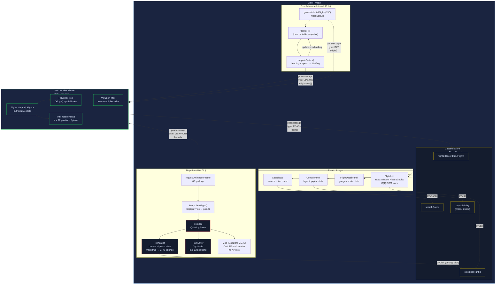

# FlightRadar

A high-performance, real-time flight radar application built for a front-end interview showcase. Demonstrates real-time data streaming, WebGL rendering, Web Workers, spatial indexing, and smooth interpolation — all running at 60 fps with 150+ simultaneous aircraft.

---

## Architecture Diagram



---

## Quick Start

> **Requires Node 20+**

```bash
# Using nvm
nvm use 20

# Install dependencies
npm install

# Start dev server
npm run dev
```

Open [http://localhost:5173](http://localhost:5173).

---

## Architecture Overview

### What was built (17 files)

| Layer | File | What it does |
|---|---|---|
| **Data** | `src/utils/mockData.ts` | Generates 150 mock flights; computes delta updates each tick at 60× real speed so planes visibly move |
| **Worker** | `src/workers/flight.worker.ts` | Web Worker — maintains the authoritative flight `Map`, runs an **R-tree** (rbush) for spatial indexing + viewport filtering, processes delta packets off the main thread |
| **State** | `src/store/useFlightStore.ts` | Zustand store — flights, selected ID, search query, layer toggles |
| **Map** | `src/components/MapView.tsx` | deck.gl `DeckGL` + `IconLayer` (planes) + `PathLayer` (trails); **60 fps `requestAnimationFrame` lerp loop** for smooth movement between 1-second updates |
| **Icon** | `src/utils/airplaneIcon.ts` | Canvas-drawn airplane silhouette as a deck.gl icon atlas; `mask: true` allows per-plane colorisation |
| **UI** | 4 components | Search bar, virtualized flight list (react-window), flight detail panel with gauges, control panel with layer toggles |

### Key design patterns implemented

- **Delta updates** — only `[id, lat, lng, heading, altitude, speed]` sent per tick, not full objects
- **Web Worker** — all data processing (trail maintenance, spatial indexing, filtering) stays off the main thread
- **WebGL rendering** — deck.gl `IconLayer` with GPU rendering, not DOM elements
- **Client-side prediction / Lerp** — `P = start + (end − start) × t` at 60 fps between 1-second server updates
- **R-tree** — rbush in the worker for O(log n) viewport filtering
- **Normalized flat store** — `Record<string, Flight>` keyed by ID in Zustand
- **Bypass VDOM for high-frequency updates** — interpolated positions go into local component state, not the global store
- **Virtualized list** — react-window `FixedSizeList` for the sidebar (only renders ~10 visible rows at a time)
- **Free basemap** — CartoDB dark-matter style via MapLibre GL JS, no API key needed

---

## Project Structure

```
flightradar/
├── src/
│   ├── main.tsx                     # React 18 root
│   ├── App.tsx                      # Orchestrates simulation, worker lifecycle, layout
│   ├── index.css                    # Dark-theme design system (CSS variables)
│   │
│   ├── types/
│   │   ├── flight.ts                # Flight, FlightDelta, ViewBounds, WorkerInMessage, etc.
│   │   └── rbush.d.ts               # Type declaration for rbush
│   │
│   ├── store/
│   │   └── useFlightStore.ts        # Zustand store (flights, selection, layers, search)
│   │
│   ├── workers/
│   │   └── flight.worker.ts         # Web Worker: R-tree, trail maintenance, viewport filtering
│   │
│   ├── utils/
│   │   ├── mockData.ts              # Flight generator + delta simulator (150 planes, 60× speed)
│   │   ├── interpolation.ts         # lerp(), lerpAngle(), interpolateFlight()
│   │   └── airplaneIcon.ts          # Canvas-based icon atlas for deck.gl IconLayer
│   │
│   └── components/
│       ├── MapView.tsx              # DeckGL + IconLayer + PathLayer + rAF interpolation loop
│       ├── FlightDetailPanel.tsx    # Right sidebar: selected flight gauges + details
│       ├── FlightList.tsx           # Left sidebar: virtualized list (react-window)
│       ├── SearchBar.tsx            # Top bar: branding + search input + live counter
│       └── ControlPanel.tsx         # Bottom bar: layer toggles + stats
│
├── index.html
├── vite.config.ts
├── tsconfig.json
└── package.json
```

---

## Data Pipeline

```
Simulation tick (1s interval, main thread)
        │
        ▼  FlightDelta[] (id, lat, lng, heading, alt, speed)
   Web Worker
        │  ── applies deltas to flight Map
        │  ── updates trail[] (last 12 positions)
        │  ── rebuilds R-tree
        │  ── filters by viewport bounds
        ▼
   Zustand Store  ←── Flight[]
        │
        ▼
   MapView (requestAnimationFrame @ 60 fps)
        │  ── lerp(prevLat→lat, prevLng→lng, elapsed/1000ms)
        ▼
   deck.gl IconLayer + PathLayer  (GPU, WebGL)
```

---

## Tech Stack

| Concern | Library | Version |
|---|---|---|
| Bundler | Vite | 5.x |
| UI framework | React | 18.x |
| Language | TypeScript | 5.x |
| Map rendering | deck.gl (WebGL) | 9.3.x |
| Base map | MapLibre GL JS | 4.7.x |
| React map wrapper | react-map-gl | 7.1.x |
| Global state | Zustand | 5.x |
| Spatial indexing | rbush (R-tree) | 3.x |
| Virtualized list | react-window | 1.8.x |

---

## UI Features

| Feature | Description |
|---|---|
| Live flight map | 150 aircraft rendered via WebGL at 60 fps |
| Smooth movement | Linear interpolation between 1-second position updates |
| Flight trails | Toggle-able path history (last 12 positions) |
| Click to select | Click any plane to open the detail panel |
| Hover tooltips | Callsign, route, altitude, speed on hover |
| Detail panel | Altitude/speed gauges, heading, position, aircraft type |
| Search | Filter by callsign, airline, or airport code |
| Virtualized list | Sidebar lists all visible flights; only ~10 DOM rows rendered |
| Layer toggles | Show/hide trails and labels |

---

## Design Reference

The architecture is based on `flightradar-design.md`, which covers:

- **High-Level Architecture** — Data Orchestrator, State Management, Map Engine, Worker Layer
- **Data Strategy** — Binary/Protobuf over JSON, delta updates, buffering, backpressure
- **Rendering Engine** — WebGL / deck.gl vs SVG/DOM tradeoffs
- **State Management** — Normalized flat store, SharedArrayBuffer, R-tree, dirty-flag system
- **UI Component Layer** — Hybrid rendering strategy, virtualized lists, high-frequency ref updates
- **Extra Credit** — Protobuf, Battery Saver mode, accessibility

---

## Available Scripts

```bash
npm run dev      # Start Vite dev server (http://localhost:5173)
npm run build    # Type-check + production build → dist/
npm run preview  # Preview the production build locally
```

---

## Notes

- **No API key required** — uses CartoDB's free dark-matter basemap (MapLibre GL JS)
- **Simulation speed** — flights move at 60× real speed so movement is visible on the map
- **Node version** — requires Node 20+; use `nvm use 20` if you have nvm installed
